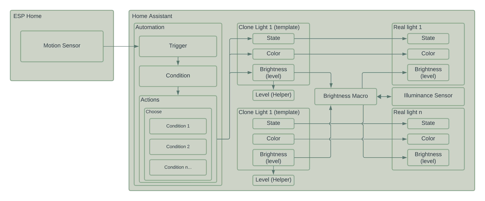

# Home Assistant and ESPHome Light Automation with Illuminance Example

This repo is a companion code set for a youtube video I created. It is not intended to be standalone code that can be run directly. It is only configuration examples that could be applied to Home Assistant or ESP Home if you wanted to accomplish the same type of automation that I created for my office lighting.

With this config, you can make a motion automated set of lights that can adjust state, color and brightness based on time of day and day of week. Additionally, this code shows an example of how to use an outdoor illuminance measurement to adjust the brightness of your lights based on how bright it is outside.

Youtube video: https://www.youtube.com/watch?v=qZYxZyq5l6c

## esphome-config folder

This folder only contains one file. It has a sample ESPHome config file for a single ESP32 with a motion sensor attached.

- Learn more about ESPHome: https://esphome.io/index.html

## home-assistant-config folder

This folder contains as much of the custom configuration from my home assistant example as I could reasonably pull as code.

- The custom_components folder contains the illuminance sensor, but please don't use this code as it could become out of date. I got this from a different github repo. I simply have it here as an example of my installation.
  - Illuminance sensor for home assistant: https://github.com/pnbruckner/ha-illuminance
- The custom_templates folder contains the Jinja2 template/macro that does the calculation for outdoor illuminance based brightness on your lights. Please watch the youtube video listed above so this makes more sense.
  - The top section contains configuration for what I have been calling "relative brightness". Use this section to try and balance maximum brightness and minimum brightness so your lights are consistent.
  - more on home assistant jinja templating: https://www.home-assistant.io/docs/configuration/templating/
- The automations.yaml file contains the two automations necessary to make this work.
  - more on Home assistant automations: https://www.home-assistant.io/getting-started/automation/
- the configurations.yaml file contains the config necessary for including the illuminance sensor as well as the light templates used to clone my real light entities and patch in the brightness calculation
  - more on light templates: https://www.home-assistant.io/integrations/light.template/
- finally, although i didnt cover this in the video specifically, the scenes.yaml file contains a simple scene that turns all the lights off.
  - more on scenes: https://www.home-assistant.io/docs/scene/

## Diagram

